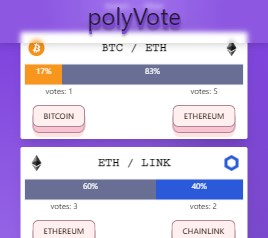

# polyVote

Connect to Polygon Mumbai Testnet before starting!

- [Get started with metamask](https://metamask.zendesk.com/hc/en-us/articles/360015489531-Getting-started-with-MetaMask)
- [How to add Polygon Mumbai to metamask](https://medium.com/stakingbits/how-to-connect-polygon-mumbai-testnet-to-metamask-fc3487a3871f#:~:text=Connect%20Metamask%20to%20Polygon%20Testnet,the%20Mumbai%20Testnet%20in%20Metamask.)

Vote on cryptocurrency pairs for which asset you believe will outperform in the future. 

Deployed link: [Link](https://polyvote.netlify.app/)

### `npm run start`

Runs the app in the development mode.\
Open [http://localhost:3000](http://localhost:3000) to view it in your browser.

The page will reload when you make changes.\
You may also see any lint errors in the console.

### `npm run build`

Builds the app for production to the `build` folder.\
It correctly bundles React in production mode and optimizes the build for the best performance.

The build is minified and the filenames include the hashes.\
Your app is ready to be deployed!